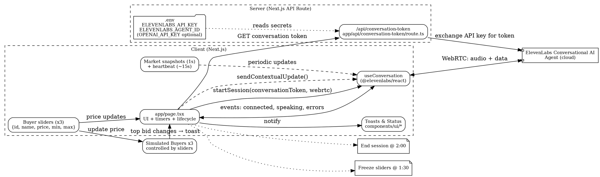

# IRELIA - Voice Negotiation Agent (Nego Agent)

This repository is a voice-enabled negotiation demo built with Next.js and ElevenLabs Conversational AI. The app runs a real-time voice agent (via WebRTC) that negotiates while you control three simulated buyers' bids using sliders. Bids are sent to the agent as contextual updates in real time.

This README has been refreshed to reflect the current codebase layout, required environment variables, and developer notes.

## Key features

- Real-time voice agent using WebRTC integration (`@elevenlabs/react` on the client)
- Secure server-side endpoint to mint short-lived conversation tokens for the agent
- Three buyer sliders (live updates sent to the agent)
- UI controls to accept a specific buyer offer or end the call and accept the best offer
- Sliders freeze at 1:30 and the session auto-ends at 2:00
- Heartbeats and lightweight market snapshots to detect silent disconnects and minimize traffic
- No persistence: all negotiation state is ephemeral and resets on page refresh

## Requirements

- Node.js 18+ (recommended)
- An ElevenLabs account with a configured Conversational AI agent (agent ID)

## Environment variables

Create a `.env` file (copy from `.env.example` if present) and add the following server-only values:

- `ELEVENLABS_API_KEY` — Your ElevenLabs API key (server-side only; never exposed to the browser)
- `ELEVENLABS_AGENT_ID` — The Conversational AI agent ID to use for sessions
- `OPENAI_API_KEY` — Optional (used in some deployments/workflows if present)

Important: The project is designed so `ELEVENLABS_API_KEY` is only used on the server (see `app/api/conversation-token/route.ts`) and is never shipped to the client.

## Quick install & run (local)

1. Install dependencies:

```bash
npm install
```

2. Start the dev server:

```bash
npm run dev
```

Open `http://localhost:3000` in your browser. Grant microphone permission when prompted (works on `localhost` or HTTPS). Click the "START AI SALES AGENT" button to connect.

## Project layout (important files)

- `app/page.tsx` — Main UI, negotiation timers, slider state, and lifecycle integration with the `useConversation` hook.
- `app/providers.tsx` and `app/layout.tsx` — App-level providers and layout.
- `app/api/conversation-token/route.ts` — Server API route that exchanges the server-side `ELEVENLABS_API_KEY` for a short-lived conversation token returned to the client.
- `components/` — UI helpers, the scramble text animation, status indicator, and theme provider.
- `components/ui/` — Reusable UI primitives (buttons, toasts, slider, dialog, etc.).
- `hooks/use-toast.ts`, `hooks/use-mobile.ts` — Small hooks used by the UI.
- `lib/utils.ts` — Utility helpers.
- `public/` — Static assets and placeholder images.

## How it works (high level)

1. The client requests a short-lived conversation token from the server at `/api/conversation-token`.
2. The client calls `useConversation.startSession({ conversationToken, connectionType: 'webrtc' })` to establish a WebRTC session with the ElevenLabs conversational agent.
3. Slider changes and user actions call `sendContextualUpdate` to give the agent market snapshots or user-offer updates.
4. While connected the client sends market snapshots every second if the market changed; otherwise it periodically sends a lightweight heartbeat (roughly every 15s) to detect silent disconnects.
5. The UI enforces a freeze time (1:30) where slider input is disabled and automatically ends the session at 2:00.

## Architecture (Graphviz)

Copy the DOT graph below into any Graphviz-compatible viewer (or save as `architecture.dot` and render with `dot -Tsvg architecture.dot -o architecture.svg`).



## Development notes & UX details

- Only one live session per tab.
- When a user accepts an offer (either a buyer or "accept best"), the UI disables further actions and ends the session.
- Toast notifications are used for disconnects, top-bid changes, and errors. Top-bid raise toasts auto-close after 5s and only appear while connected.

## Troubleshooting

- If WebRTC (microphone/peer connection) fails on mobile, ensure the site is served over HTTPS and microphone permissions are granted.
- If you see errors like `could not establish pc connection` or `RTCDataChannel.readyState is not 'open'`:
  - Try reconnecting (STOP AGENT → START AI SALES AGENT).
  - Test on desktop to isolate mobile/permission/network issues.
  - Check server logs for failures in `app/api/conversation-token/route.ts` (invalid API key or network issues to ElevenLabs)

## Deployment

This project is Vercel-friendly. Typical steps:

1. Push the repo to GitHub.
2. Import the repo on Vercel and set the environment variables (`ELEVENLABS_API_KEY`, `ELEVENLABS_AGENT_ID`, optionally `OPENAI_API_KEY`).
3. Build command: `next build` (default). Output: Next.js standard serverless output.

## Tests & checks

There are no formal tests included. Before deploying, run the dev server and manually validate the voice session and sliders. Consider adding unit or integration tests for critical helpers in `lib/utils.ts` and the `useConversation` integration.

## TODO / Next improvements

- Add a small real-time visualization (price-over-time chart) to make negotiation progress easier to scan at a glance.
- Add automated tests for the core market snapshot logic and any utility formatting functions.
- Add guidance/UX for mobile permission flows and a fallback when microphone access is denied.

## License & contribution

This repo contains example/demo code. Feel free to open issues or PRs with improvements.

---

If you'd like, I can also add a small `README.dev.md` with local debugging tips or add a basic smoke test that starts the Next.js dev server and checks `/` for a 200 response.
